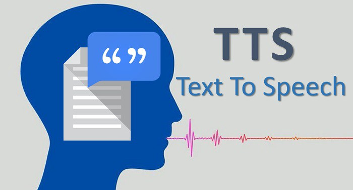

# PhotoTextToSpeech

 
The project is to create a computer program that will take in a picture of a computer printed message, convert the picture to text, and then have the computer read aloud what the message said.
 
 
Keywords

text-to-speech, tts, aws, ibm watson, audio, photo text-to-speech, speech, text, microsoft, word, neural network, image recognition, image orientation, robot, Pillow, EXIF, Keras, TensorFlow, pyttsx3

 

